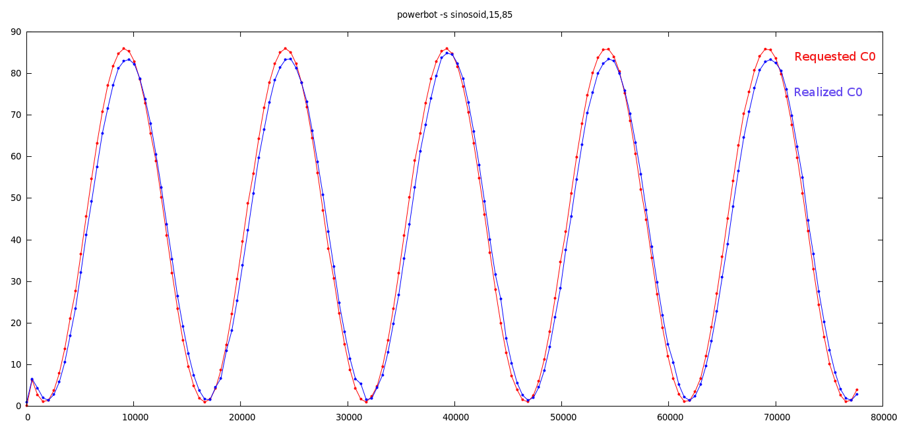

Power Stress and Shaping Tool __(PSST)__ - a tool for controlled stress & monitor of x86 SoC for power/thermal analysis.

What can psst do?
=================
__PSST__ is a userspace controlled power virus for cpu and other soc-sub components such as gpu & memory.
Presently only cpu is supported. The intent is to subject the SoC at different run-time-varying utilization levels for analysis.
This is done by controlled duty-cycling of utilization to specific contour.
A simplest contour could be fixed low utilization. This allows simple usage such as logging of system parameters at fixed low overhead even at small polling intervals (ms).
More complex usages, such as study of governors, workloads e.t.c., are possible by applying different power shape contours. 

Dependencies
============
The tool has a dependency on certain x86 model-specific registers. This can be addressed by loading msr.ko module.
Normally, this should suffice:

	$ sudo modprobe msr

Additionally, if you need to monitor the power parameters, ensure that the kernel is upto-date with the x86 platform
being used. If energy counters for the platform are not supported in the present version of intel_rapl driver, you see this message:

	$ dmesg | grep rapl
	 intel_rapl: driver does not support CPU family xxx model yyy

In that case, update with the latest intel_rapl driver which supports it.

Why another virus?
=================
The fundamental difference compared to other power virus or monitor tools is that, the work done during hog is not
a dummy function, but own useful work functions such as accounting, logging (in-memory), or power shape contour 
change etc. psst just executes real work function duty-cycled in controlled loops. More work functions could be 
added to the this tool overtime & they will be accounted for good -- against the ON-time of duty cycling.

The tool's most important usecase is to do logging at a fixed "own" overhead --not more than the present requested
load (active C0 percent). This ensures that monitoring does not influence the overall system load (C0%). This serves
to monitor soc power/thermal parameters at much fine grained time, typically comparable to governers's poll period 
(tens of ms).  For instance, a 10ms poll could causes up to 50% cpu overhead in traditional polling. Further, psst's logging
is aligned with the C0 activity that is being analyzed. This ensures a good coalesced synthetic workload.

Sample output with verbose mode
===============================
	Verbose mode ON
	CPU domain. Following 4 cpu selected:
		cpu 0	[was online or chosen]
		cpu 1	[was online or chosen]
		cpu 2	[was online or chosen]
		cpu 3	[was online or chosen]

	poll period 500ms
	run duration 3600000ms
	Log file path: /var/log/psst.csv
	power curve shape: single-step,0.1
	#     Time,     FreqReal,     LoadIn,     LoadOut,      PkgPwr,       PwrCore,      PwrGpu,      PwrDram,     CpuDts,     SocDts
	#     [ms],        [MHz],     [C0_%],      [C0_%],      [mWatt],      [mWatt],      [mWatt],     [mWatt],     [DegC],     [DegC]
	#--------------------------------------------------------------------------------------------------------------------------------
	        0,         2914,       0.10,        1.00,         0.00,         0.00,         0.00,        0.00,      24.00,      24.00
	      506,         2903,       6.31,        6.56,      1466.67,       868.53,         0.00,      284.18,      24.00,      22.00
	     1015,         2901,       2.75,        4.37,      1122.80,       572.63,         0.00,      283.08,      20.00,      21.00
	     1523,         2900,       1.11,        2.00,       782.23,       251.71,         0.00,      281.98,      20.00,      21.00
	     2031,         2900,       1.46,        1.46,       664.79,       134.03,         0.00,      279.91,      20.00,      21.00
	^C

_Note:_ Sometimes system study involves clamping values or disabling features that influence result parameters.
      Typically this involves frequency influencing features such as cpu-freq governors or other such features.
      Clamping frequency is not intended part of this tool. Such requirement are best handled on per-platform using
      sysfs or appropriate interface. However, it may be a good idea to kill Xwindows and run in console mode, if background
      tasks are treated as irrelevant utilization noise in your analysis.

Plotting and analysis
=====================
The generated csv can be analyzed using any plotting tool. Following example illustrates with _gnuplot_.
To plot the LoadOut i.e., realized load and cpu dts temperature check the column# from logfile /var/log/psst.csv

	$ sudo apt-get install gnuplot-x11
	$ gnuplot
	gnuplot> cd '/var/log'
	gnuplot> set datafile separator ','
	gnuplot> plot 'psst.csv' using 1:4 w lines, 'psst.csv' using 1:9 w lines

USAGE
=====
	$ ./psst --help

	psst [options <value>]
		Supported options are:
		-C|--cpumask		<CPUMASK> hex bit mask of cpu# to be selected.
	        	        	(e.g., a1 selects cpu 0,5,7. default: every online cpu. Max:400 [1024])
		-p|--poll-period	<pollperiod> (ms) for logging (default: 500 ms)
		-d|--duration		<duration> (ms) to run the tool (default: 3600000 i.e., 1hr)
		-l|--log-file		</path/to/log-file> (default: /var/log/psst.csv)
		-v|--verbose		enables verbose mode (default: disabled when args specified)
		-V|--Version		prints version when specified
		-T|--track-max-cpu	track the cpu# which had max freq during each polling
		-h|--help       	prints usage when specified
		-s|--shape-func		<shape-func,arg> (default: single-step,0.1)
		Supported power shape functions & args are:
			<single-step,v>		where v is load step height.
			<sinosoid,w,a>		where w is wavelength [seconds] and a is the max amplitude (load %)
			<stair-case,v,u>	where v is load step height, u is step length (sec)
			<single-pulse,v,u>	where v is load step height, u is step length (sec)
			<linear-ramp,m>		where m is the slope (load/sec)
			<saw-tooth,m,a>		slope m (load/sec);reversed after max a% or min(0.1)%
	
	example 1: use psst just for logging system power/thermal parameters with minimum overhead
		   $ sudo ./psst	 #implied default args: -s single-step,0.1 -p 500 -v

	example 2: linear ramp CPU power with slope 3 (i.e., 3% usage increase every sec) applied for cpu0, cpu1 & cpu3.
		   poll and report every 700mS. output on terminal. run for 33 sec
		   $ sudo ./psst -s linear-ramp,3 -C b -p 700 -d 33000 -v

More details on some options
============================
	 -T|--track-max-cpu		Track the cpu# with maxed freq during poll period
  With this option, the cpu that did max frequency in the poll window is determined & printed in output.
  one application of this, can be in determination of symmetric load distribution on SMP systems wherein each cpu
  gets roughly equal percent of hits at the end.

_Note:_ different cpu can be stressed with different functions simultaneously. To do this just invoking separate
      commands for each cpu. Here is a fun example to demonstrate the controllability of linear ramp on cpu0,
      sine wave on cpu1, single-step on cpu2, single-pulse on cpu3 -- at the same time.

Launch "system monitor" like utility to observe system load. Then execute the following _one-shot_ in a terminal window:

	sleep 2; sudo ./psst -C 0 -d 30000 -s linear-ramp,2 &
	sleep 2; sudo ./psst -C 1 -d 30000 -s sinosoid,15,50 &
	sleep 2; sudo ./psst -C 2 -d 30000 -s single-step,20 &
	sleep 5; sudo ./psst -C 3 -d 30000 -s single-pulse,60,2 &

Code structure
==============
	.
	|-- logger.c		# in-memory logging functions
	|-- logger.h
	|-- Makefile
	|-- parse_config.c	# parse cmdline related routines
	|-- parse_config.h
	|-- perf_msr.c		# x86 msr counters for aperf/mperf etc
	|-- perf_msr.h
	|-- psst.c      	# main routine & core work function
	|-- psst.h
	|-- rapl.c      	# x86 energy register interface
	`-- rapl.h

Build
=====
	 $sudo make
	 $sudo ./psst

Version log
===========
	11/2017		v0.1	first checkin. supports cpu load. about 6 power shape functions.
				last test platform: kabylake mobile/client.
